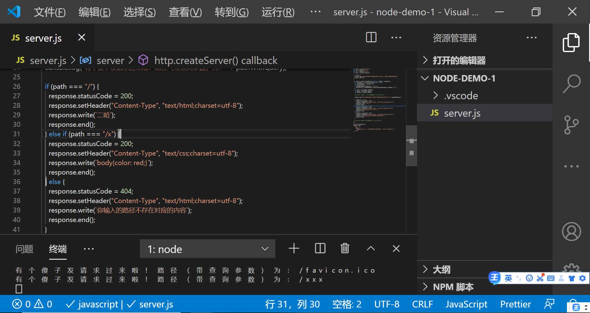

### HTTP 入门

Hyper Text Transfor protocol

### 几个特殊的 IP：127.0.0.1 表示自己 localhost 指定为自己 0.0.0.0 不表示人任何装备

域名就是对 IP 的别称，知识点一个域名可以对应不同 IP，这个叫做均衡负载，防止一台机器扛不住，一个 IP 可以对应不同域名，这个叫做主机共享

URL：协议+域名或 IP+端口号+路径+查询字符串+锚点
URL 简称 uniform resource locator

### curl 命令

·用 curl 可以发 HTTP 请求
·curl -v http://baidu.com
·curl -s-v --https://www.baidu.com
理解以下概念：url 会被 curl 工具重写，先请求 DNS 获得 IP
·先进行 TCP 连接，TCP 连接成功后，开始发送 HTTP 请求
·请求内容看一眼·响应内容看一眼·响应结束后，关闭 TCP 连接

### HTTP：规定请求的格式是什么，响应的格式是什么

如何做出一个响应
·需要编程
Node.js 有一个 http 模块可以做到
注意事项：
·这些代码就是服务器代码，一般放在服务器上，path 是不带拆讯参数的路径/x query 是查询参数的对象形式{a:'1}
queryString 是查询参数的对象形式的字符串形式？a=1
pathWithQuery 是带查询参数的路径，一般不用
request 是请求对象
response 是响应对象

### 

代码逻辑：`这种字符串`里面可以回车
'这种字符串'里面只能用\n 表示
·逻辑
·每次收到请求都会把中间的代码执行一遍
·用 if else 判断路径，并返回响应
·如果是已知路径，一律返回 200
·如果是未知路径，一律返回 404
·Content-Type 表示内容的[类型\语法] conttent-type 才是决定文件类型的关键
·response.write()可以填写返回的内容
·response.end()表示响应可以发给用户了，保险起见加 end

个人总结：
如果设置路径为/，那么 Ceder 输入 curl http://127.0.0.1:8888/ 就会有二哈回应 【 VScode 要 node server.js 8888 接受中】

### 

通过 HTTP 传到浏览器，开发者工具查看响应的内容，一个路径返回 HTML 字符串，一个路径返回 CSS 字符串

### 系统学习 HTTP

RFC 2612 是 HTTP 的规格文档

请求：·请求动词 路径加查询参数 协议名/版本
·Host：域名或 IP
·Accept：text/html
·Content-Type：请求的格式
·回车
·请求体（也就是上传内容）

细节：
·三部分：请求行，请求头，请求体 背下来
·请求动词有 git，post，put，patch，delete 等 git 和 post 记住很重要
·请求体在 GET 请求中一般
·文档位于 RFC 2612 第六章

响应：
·协议名/版本 状态码 状态字符串 背下来
·Content-Type：响应体的格式
·回车
·响应体（也就是下载的内容）

细节：三部分：状态行，响应头，响应体
·常见的状态码是考点
·文档位于 RFC 2612 第六章

### 用 curl 构造请求

·curl -v http://127.0.0.1:8888
·请求动词： -X POST 注意大小写

·设置路径和查询参数
直接在 url 后面加

·设置请求头
-H`Name：Value`或者--header`Name:Value`
·设置请求体：-d`内容`或者`内容`

### console.log 调试大法   na里感觉不对就console.log那里
